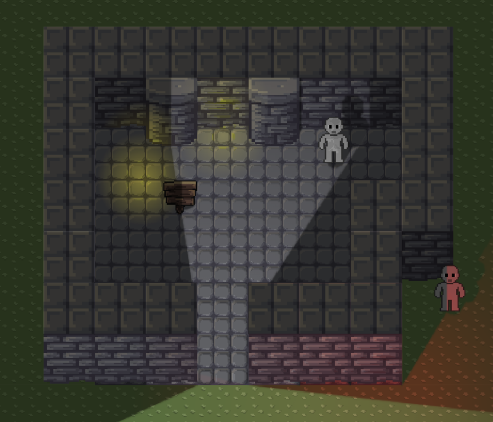
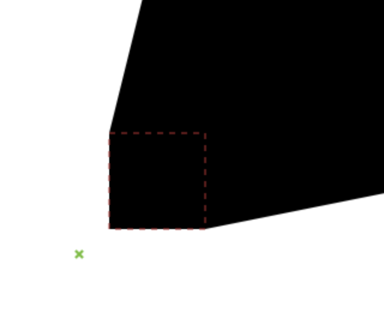
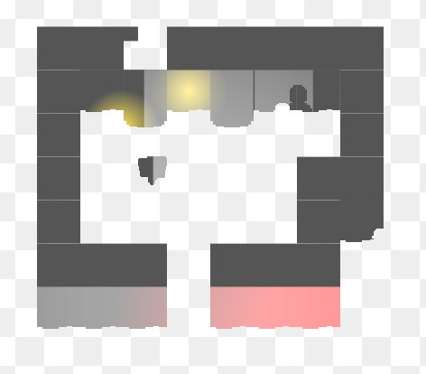

# Lighting and shadows in 2.5d

This is an experiment showing how to create a 2.5d scene with lighting and shadows.



(the above scene is in `/samples/sample-scene-1.json`)

## How to use it

A scene consists of shadow casters, shadow receivers, and lights.

First, we create a `LightingSystem`:

```ts

const lightingSystem: LightingSystem = new LightingSystem({
  imageSmoothingEnabled: false,
});
```

Lights can be added to the lighting system like so:

```ts
lightingSystem.lights.push(new Light({
  position: vec(100, 100),
  radius: 100,
  colour: 'white',
  intensity: 0.5,
}));
```

Update the lighting system every frame:

```ts
lightingSystem.update(dt);
```

This will update each light.

Next, prepare the lightmap every frame (usually this should be inside the `draw()` function):

```ts
lightingSystem.prepare(
  camera,
  groundShadowReceivers,
  wallShadowReceivers,
  regionShadowCasters,
  spriteShadowCasters,
  circleShadowCasters
);
```

Render the scene as usual. Finally, overlay the lightmap onto the scene:

```ts
lightingSystem.draw(context);
```

## How it works

> Note: the `vec` type is from [@basementuniverse/vec](https://www.npmjs.com/package/@basementuniverse/vec) and looks like:
> ```ts
> type vec = {
>   x: number;
>   y: number;
> }
> ```

Shadow casters can be one of:

#### `RegionShadowCaster`

This is a rectangle that casts polygonal shadows.

* `id: string` a unique identifier
* `position: vec` the position of the shadow caster
* `size: vec` the size of the shadow caster (axis-aligned rectangle)
* `includeRegionShadow: boolean` when casting shadows, should we include the rectangular region of the shadow caster?

e.g.

`includeRegionShadows = false` (default value)


`includeRegionShadows = true`



#### `SpriteShadowCaster`

This is a rectangle with a sprite name. The sprite will be rotated and stretched when casting shadows.


* `id: string` a unique identifier
* `position: vec` the position of the shadow caster
* `size: vec` the size of the shadow caster (axis-aligned rectangle), this will be used as the size of the sprite
* `shadowName: string` the name of the sprite used for casting shadows
* `anchor: vec` the anchor point of the sprite where (0, 0) is the top-left corner, (0.5, 0.5) is the center, (1, 1) is the bottom-right corner
* `offset: vec` used to offset the sprite from the anchor position
* `minShadowLength: number` the minimum length of the shadow
* `maxShadowLength: number` the maximum length of the shadow

We use a smoothstep interpolation to make the shadow length vary between `minShadowLength` and `maxShadowLength` based on the distance between the light and the `SpriteShadowCaster`.

#### `CircleShadowCaster`

This is a rectangle which casts an elliptical shadow.


* `id: string` a unique identifier
* `position: vec` the position of the shadow caster
* `size: vec` the size of the shadow caster (axis-aligned rectangle), this will be used as the size of the ellipse
* `anchor: vec` the anchor point of the circle where (0, 0) is the top-left corner, (0.5, 0.5) is the center, (1, 1) is the bottom-right corner
* `minShadowDistance: number` the minimum distance between the anchor position and center of the shadow ellipse
* `maxShadowDistance: number` the maximum distance between the anchor position and center of the shadow ellipse

We use a smoothstep interpolation to make the shadow distance vary between `minShadowDistance` and `maxShadowDistance` based on the distance between the light and the `CircleShadowCaster`.

---

Shadow receivers can be one of:

#### `GroundShadowReceiver`

This is a rectangle that receives ground shadows.


* `id: string` a unique identifier
* `position: vec` the position of the shadow receiver
* `size: vec` the size of the shadow receiver (axis-aligned rectangle)
* `colour: string` an optional background colour for the shadow receiver
* `spriteName: string` the name of the sprite used for rendering this shadow receiver (the sprite will be repeated)

#### `WallShadowReceiver`

This is a rectangle or sprite that receives wall shadows.


* `id: string` a unique identifier
* `position: vec` the position of the shadow receiver
* `size: vec` the size of the shadow receiver (axis-aligned rectangle)
* `colour: string` an optional background colour for the shadow receiver
* `receiveLight: boolean` true if this shadow receiver should receive light and shadows (useful for tops of walls which should only receive ambient light)
* `spriteName: string` the name of the sprite used for rendering this shadow receiver
* `maskName: string` the name of a sprite used for masking the shadow receiver (optional)
* `spriteRepeat: boolean` true if the sprite should be repeated, false if the sprite should be stretched
* `layer: WallShadowLayer` either `WallShadowLayer.One` or `WallShadowLayer.Two`

---

### Overview of `LightingSystem.prepare()` steps

1. Prepare each light separately
2. Prepare the ground mask
3. Prepare the wall mask (layer 1)
4. Prepare the wall mask (layer 2)
5. Prepare the ground-masked lightmap
6. Prepare the wall-masked lightmap (layer 1)
7. Prepare the wall-masked lightmap (layer 2)

The 3 light maps (ground, wall layer 1, and wall layer 2) can now be combined to create the final light map. This is done inside `LightingSystem.draw()`.

#### 1. Prepare each light separately

##### 1.1. Prepare the base lightmap

First we prepare the base lightmap for the current light by drawing a radial gradient. We only do this if any of the light's parameters have changed.


##### 1.2. Prepare the ground lightmap

We draw the base lightmap onto the ground lightmap and then draw ground shadows for each shadow caster in range of the light.


##### 1.3. Prepare the wall lightmaps (both layers 1 and 2)

We draw the base lightmap onto each of the wall lightmaps.

Next, we prepare initial shading for each wall shadow receiver in range of the light. This means we shade the entire receiver based on the y-position of the light relative to the y-position of the receiver's bottom edge.

There's a small amount of margin when doing this, so that light can fade in gradually rather than snapping on/off.

Also note that wall lighting has a small amount of y-offset which helps to create a more realistic "pseudo-3d" lighting effect.


Finally, we project shadows onto the wall lightmaps. This is done by finding where ground shadows intersect the bottom edges of shadow receivers and drawing regions, scaled/rotated sprites, or ellipses onto the wall lightmaps (either layer 1 or 2 depending on the shadow caster's settings).


The lightmap for this light is now complete. We do this for each light in the scene.

#### 2. Prepare the ground mask

We draw all of the ground shadow receivers onto the ground mask.

Next, we subtract all of the wall shadow receivers (ignoring their layer settings) using the `destination-out` composite operation.

This is done using each receiver's `drawMask()` method.


#### 3. Prepare the wall mask (layer 1)

Similarly to the ground mask, we draw all of the wall shadow receivers for layer 1 onto the layer 1 wall mask, then subtract all of the layer 2 wall shadow receivers.

This is done using each receiver's `drawMask()` method.


#### 4. Prepare the wall mask (layer 2)

We draw all of the layer 2 wall shadow receivers onto the layer 2 wall mask.

This is done using each receiver's `drawMask()` method.


#### 5. Prepare the ground-masked lightmap

We fill the ground-masked lightmap canvas with the ambient light colour, then we draw each light's ground lightmap using the `screen` composite operation.

Finally, we mask the ground-masked lightmap using the ground mask and the `destination-atop` composite operation.


#### 6. Prepare the wall-masked lightmap (layer 1)

We do the same for the layer 1 wall lightmap...



#### 7. Prepare the wall-masked lightmap (layer 2)

...and again for the layer 2 wall lightmap.


---

When the masked lightmaps are combined, we get the final lightmap.


If we take the un-lit scene...


...and overlay the final lightmap using the `multiply` composite operation, we get the final scene with lighting and shadows.


### Why 2 wall layers?

Because some wall shadow receivers might overlap. When a shadow caster overlaps a wall shadow receiver, we skip rendering shadows from that caster onto the overlapping receiver (so that objects don't self-shadow / shadows are _behind_ the objects that cast them).

However, if there was just a single layer, then when 2 wall shadow receivers overlap they would be masked onto the same wall-mask. This can cause strange artefacts.


By separating objects which might overlap onto separate layers, we can avoid this issue.

As long as shadows aren't too large and we don't have too many objects overlapping (e.g. more than 2), then 2 layers should be enough.

## Plans

- [ ] convert this into an NPM package that can be dropped into any game project
- [x] soft shadows using `shadowBlur` (maybe? this might be too slow)
- [ ] each light could generate a normal map, meaning we could use a shader for bump mapping, specular highlights, etc.
